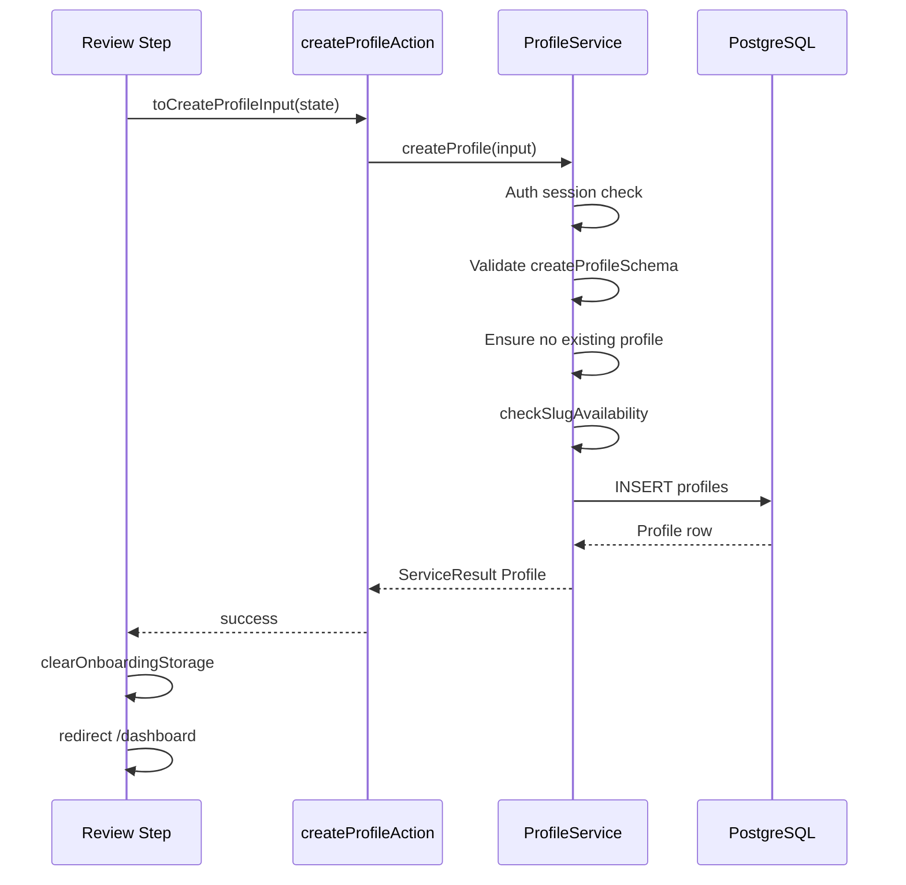

# Profile Onboarding

This document describes the TrustLoop professional profile onboarding wizard, state management, and profile creation flow.

## Why onboarding is split into multiple steps

A single long form overwhelms users and increases abandonment. Breaking setup into focused steps:

- Reduces cognitive load (one decision per screen)
- Allows contextual validation before moving forward
- Supports mobile-first layouts with clear progress
- Maps cleanly to reusable `OnboardingLayout` components

Steps: Welcome → Profession → Display name → Username → Bio → Photo → Location → Review.

## Why profiles are created only after onboarding is complete

Profile rows represent **published professional identity**, not draft data. Creating the record only on the review step ensures:

- No partial or incomplete profiles in the database
- Atomic creation with full validation
- Clear `has_profile` signal for routing guards
- Onboarding can only be completed once per account

Temporary wizard data lives in **browser localStorage** until submission.

## User experience and maintainability

| Concern | Approach |
|---------|----------|
| Progress persistence | `localStorage` key `trustloop-onboarding-v1` |
| Step guards | Client hook redirects to earliest incomplete required step |
| Route guards | Middleware + layouts block completed users from `/welcome` and `/onboarding/*` |
| Data access | Server actions → Services (no Supabase in React) |
| Validation | Zod schemas per step + `createProfileSchema` on submit |

Each step is a thin page + step component. Shared chrome lives in `OnboardingWizardShell`.

## Wizard architecture

```
/welcome
  └─ Link → /onboarding/profession
/onboarding/profession … /onboarding/review
  └─ OnboardingWizardShell
       ├─ ProgressHeader / ProgressIndicator
       ├─ Step-specific form
       └─ ProgressFooter (Back / Continue)
```

**Key files**

| File | Role |
|------|------|
| `src/lib/onboarding/wizard-state.ts` | Step metadata, route helpers, `toCreateProfileInput()` |
| `src/hooks/use-onboarding-wizard.ts` | localStorage sync, slug auto-generation, step guards |
| `src/components/onboarding/onboarding-wizard-shell.tsx` | Shared step layout |
| `src/components/onboarding/steps/*` | Individual step UIs |
| `src/app/actions/onboarding.actions.ts` | Server actions for wizard |

## State management

```typescript
interface OnboardingWizardState {
  professionId: string | null;
  fullName: string;
  slug: string;
  slugManuallyEdited: boolean;
  bio: string;
  profilePhotoUrl: string | null;
  city: string;
  state: string;
}
```

- **Hydration:** On mount, state is read from `localStorage`.
- **Persistence:** Every state change writes back to `localStorage`.
- **Clear:** On successful `createProfile`, storage is cleared before redirect to `/dashboard`.
- **Photos:** Uploaded immediately to Supabase Storage; only the public URL is stored in wizard state (not a DB row).

Required fields for submission: profession, display name, username, city, state. Bio and photo are optional.

## Profile creation flow



`ProfileService.createProfile()` is the **only** place that writes profile records.

## Slug generation

- Display name changes auto-generate a username via `generateSlug()` in `src/lib/utils/slug.ts`.
- Manual edits set `slugManuallyEdited: true` and stop auto-updates.
- User input is sanitized with `sanitizeSlug()`.
- Availability is checked with debounced `checkSlugAvailabilityAction` (live feedback) and again in `ProfileService` before insert.
- DB column: `profiles.username` (public slug / `@handle`).

## Image upload flow

1. User selects file on the Photo step.
2. `uploadProfilePhotoAction` → `ProfileService.uploadProfilePhoto(file)`.
3. Service validates type (JPEG/PNG/WebP/GIF) and size (≤ 5 MB).
4. File uploads to `avatars/{userId}/{timestamp}.{ext}` (Supabase Storage).
5. Public URL returned and stored in wizard state as `profilePhotoUrl`.
6. On profile creation, URL is saved to `profiles.avatar`.

Upload failures show inline errors; user can retry or skip photo.

## Professions

Loaded from `professions` table via `ProfessionService.getProfessions()` — never hardcoded in UI.

Migration `011_create_professions.sql` creates the table and seeds initial professions.

## Future profile editing strategy

Profile editing is **not implemented** in this phase. Planned approach:

- Reuse Zod `updateProfileSchema` (partial of create schema)
- Implement `ProfileService.updateProfile()` with owner-only authorization
- Separate `/dashboard/settings/profile` route (not onboarding)
- Slug changes require availability re-check; consider redirect from old `@username` URLs
- Photo updates reuse `uploadProfilePhoto` with optional cleanup of prior storage objects

Onboarding routes remain blocked once `has_profile` is true; editing happens only in the dashboard settings area.
