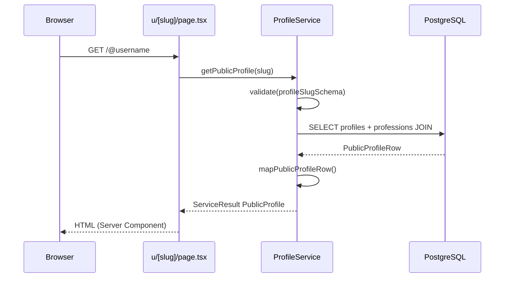

# Public Professional Profiles

This document describes how TrustLoop serves public professional profile pages at `/@username`.

---

## Why public profiles are separate from the dashboard

| Concern | Public profile (`/@username`) | Dashboard (`/dashboard`) |
|---------|------------------------------|---------------------------|
| Audience | Clients, prospects, anyone | Authenticated owner only |
| Auth | None required | Session required |
| Data | Public fields only | Owner context, settings, future analytics |
| Rendering | Server Component, cacheable | Dynamic, personalized |
| Purpose | Trust, discovery, sharing | Management |

Separating these routes keeps public pages fast, SEO-friendly, and free of private UI. The dashboard can evolve independently without leaking owner-only features to anonymous visitors.

---

## Why all profile data flows through ProfileService

React components never call Supabase directly. Public pages use:

```
Page (Server) → ProfileService.getPublicProfile(slug) → PostgreSQL
```

Benefits:

- **Single source of truth** for field selection (public vs internal)
- **Consistent validation** via `profileSlugSchema`
- **Uniform errors** (`NOT_FOUND`, `VALIDATION_ERROR`) via `ServiceResult`
- **Future-proofing** — reviews and ratings plug into the service layer without page changes

---

## Routing

Public URLs use the `@username` convention:

```
https://trustloop.app/@jane-doe
```

Next.js cannot use `@` as a literal App Router segment (reserved for parallel routes), so a rewrite maps the public URL to an internal route:

| Public URL | Internal route | File |
|------------|----------------|------|
| `/@:slug` | `/u/:slug` | `src/app/u/[slug]/page.tsx` |

Configured in `next.config.ts`:

```typescript
{ source: "/@:slug", destination: "/u/:slug" }
```

Middleware treats both patterns as public in `isPublicRoute()` (`src/lib/auth/routes.ts`).

Helper utilities:

- `getPublicProfilePath(username)` → `/@username`
- `getPublicProfileUrl(username)` → full absolute URL

---

## Data flow



### `PublicProfile` shape

Only public fields are exposed:

```typescript
interface PublicProfile {
  username: string;
  displayName: string;
  avatar: string | null;
  bio: string | null;
  professionName: string | null;
  city: string | null;
  state: string | null;
  averageRating: number;   // placeholder (0)
  totalReviews: number;    // placeholder (0)
  memberSince: string;     // ISO date from created_at
  isComplete: boolean;
}
```

Internal fields (`id`, vote counts, follower metrics) are never returned.

### Service methods

| Method | Returns | Use case |
|--------|---------|----------|
| `getProfileBySlug(slug)` | Full `Profile` | Internal / owner flows |
| `getPublicProfile(slug)` | `PublicProfile` | Public pages, sharing, cards |

---

## Server rendering

The profile page is a **Server Component**:

- Data fetched on the server per request (`dynamic = "force-dynamic"`)
- `generateMetadata()` sets title and Open Graph from profile data
- Images use `next/image` with `priority` on the hero avatar
- Only `ProfileActions` is a Client Component (share clipboard / Web Share API)

### Edge cases

| Case | Behavior |
|------|----------|
| Profile not found | `notFound()` → custom `u/[slug]/not-found.tsx` |
| Incomplete profile | Warning banner; still renders available fields |
| Missing bio | Optional “No bio yet” notice when profile is otherwise complete |
| DB error | Throws to Next.js error boundary |

**Incomplete** means missing display name, profession, city, or state.

---

## Components

Reusable building blocks in `src/components/profile/`:

| Component | Type | Role |
|-----------|------|------|
| `ProfileHeader` | Server | Photo, name, username, profession, location |
| `ProfileStats` | Server | Rating, review count, member since (placeholders for reviews) |
| `ProfileBio` | Server | About section |
| `ProfileActions` | Client | Share + disabled Request Review |
| `ProfileCard` | Server | Compact link card for future listings |
| `PublicProfileView` | Server | Composes the full page layout |

---

## Future review integration

When reviews are implemented:

1. Add `ReviewService.getReviewsByProfile(slug)` and average rating aggregation
2. Extend `getPublicProfile()` to fetch real `averageRating` and `totalReviews`
3. Enable **Request Review** in `ProfileActions` (links to review request flow)
4. Add a reviews list section below `ProfileBio` as a Server Component
5. Consider `revalidate` or ISR for public profiles with stable review data

No changes to the public URL structure or rewrite are required.

---

## Key files

| File | Purpose |
|------|---------|
| `src/app/u/[slug]/page.tsx` | Server page |
| `src/app/u/[slug]/not-found.tsx` | Custom 404 |
| `src/services/profiles/profile.service.ts` | `getPublicProfile()` |
| `src/services/profiles/public-profile.mapper.ts` | Row → `PublicProfile` |
| `src/types/profile.ts` | `PublicProfile` type |
| `src/lib/profile/public-url.ts` | URL helpers |
| `next.config.ts` | `/@:slug` rewrite |
